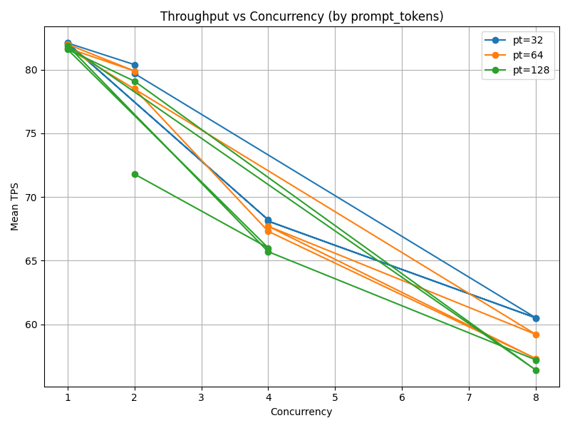

# Disaggregated-PD vLLM (Prefill/Decode) – Minimal Testbed

This repository contains a minimal, reproducible setup to **separate Prefill (Producer)** and **Decode (Consumer)** on vLLM using a tiny HTTP proxy that forwards OpenAI-compatible requests to the registered nodes.

It includes:
- A **Quart** proxy that distributes `/v1/completions` and `/v1/chat/completions` over separate prefill/decode nodes and handles ZMQ-based registration.
- A **one-shot shell script** to launch **Proxy → Consumer → Producer**, with robust checks, per-GPU binding, and **fail-fast cleanup**.
- A simple **benchmark** to measure **TTFT** (Time-to-First-Token) and **throughput** over the proxy.

> Tested with vLLM `0.11.0` and CUDA GPUs (A100 class). Adjust ports/GPU IDs as needed.

---

## Contents

- `proxy/disagg_proxy_p2p_nccl_xpyd.py`  
  The proxy server. Borrowed from vLLM example (Apache-2.0); see `NOTICE.md`.
- `scripts/disaggregated_prefill.sh`  
  Launches Proxy, Consumer (decode), Producer (prefill) with safety and auto-cleanup.
- `bench/bench_pd.py`  
  Async HTTP benchmark for TTFT and tokens/sec through the proxy.
- `requirements.txt`  
  Python deps for the proxy/bench.
- `NOTICE.md` and `third_party_licenses/APACHE-2.0.txt`  
  License notice for upstream content.
  
---

## Prerequisites

- Linux with CUDA GPUs
- Python 3.10+ (3.12 OK)
- vLLM installed in your environment (API server binary `vllm` must be on PATH)
- A model available, e.g. `Qwen/Qwen2.5-7B-Instruct`
- (Optional) `hey` for quick HTTP load

> The proxy/bench use these Python deps: `quart`, `aiohttp`, `msgpack`, `pyzmq`, `uvloop`. Install with:
>
> ```bash
> pip install -r requirements.txt
> ```

---

## Environment Variables

Key knobs consumed by `scripts/disaggregated_prefill.sh`:

| Var | Default | Meaning |
|---|---:|---|
| `SRV_IP` | first IP from `hostname -I` | Node IP used by proxy and KV P2P connector |
| `MODEL` | `Qwen/Qwen2.5-7B-Instruct` | Model name |
| `CACHE_DIR` | `$HOME/.cache/vllm` | vLLM download cache |
| `OPENAI_API_KEY` | `sk-noop` | Proxy forwards this header to nodes |
| `PROXY_HTTP_PORT` | `10001` | Proxy HTTP port |
| `PROXY_ZMQ_PORT`  | `30002` | Proxy ZMQ port (service discovery) |
| `CONS_HTTP_PORT` | `8200` | Consumer (decode) HTTP |
| `CONS_ZMQ_PORT`  | `14579` | Consumer (decode) ZMQ |
| `PROD_HTTP_PORT` | `8100` | Producer (prefill) HTTP |
| `PROD_ZMQ_PORT`  | `14580` | Producer (prefill) ZMQ |
| `CONS_GPU` | `2` | GPU index for Consumer |
| `PROD_GPU` | `1` | GPU index for Producer |
| `CONS_UTIL` | `0.8` | vLLM `--gpu-memory-utilization` for Consumer |
| `PROD_UTIL` | `0.8` | vLLM `--gpu-memory-utilization` for Producer |
| `CONS_WAIT` | `120` | Max seconds to wait for consumer port to open |
| `PROD_WAIT` | `120` | Max seconds to wait for producer port to open |

> Producer runs in **SAFE mode** by default to avoid CUDA graph assertion during KV transfer:  
> `VLLM_TORCH_COMPILE=0`, `VLLM_USE_DYNAMO=0`, `VLLM_DISABLE_CUDA_GRAPH=1`.

---

## How to Run

1) **Start the stack**:
```bash
export OPENAI_API_KEY=sk-noop
cd setup
./env_setup.sh
```

You should see in `logs/proxy.log` lines like:
```bash
Add [HTTP:172.16.x.x:8200, ZMQ:172.16.x.x:14579]
Add [HTTP:172.16.x.x:8100, ZMQ:172.16.x.x:14580]
```
2) **Quick smoke test:**
```bash
curl -sS http://$SRV_IP:$PROXY_HTTP_PORT/v1/chat/completions \
  -H "Content-Type: application/json" \
  -H "Authorization: Bearer $OPENAI_API_KEY" \
  -d '{
    "model":"Qwen/Qwen2.5-7B-Instruct",
    "messages":[{"role":"user","content":"hello"}],
    "max_tokens":32,
    "stream":false
  }' | jq .
```

3) **Run the benchmark:**
```bash
cd ../bench
python bench_pd.py \
  --host "$SRV_IP" --port 10001 --model "Qwen/Qwen2.5-7B-Instruct" \
  --requests 100 --concurrency 16 --prompt-tokens 64 --max-tokens 128
```

The script prints:
- TTFT p50/p95/min/max (streaming)
- Per-request tokens/sec p50/p95/mean
- Aggregate throughput (sum tokens / wall time)

## Notes & Tips

- If you see HTTP 500 from proxy with ZeroDivisionError in proxy.log, it means no nodes registered yet (empty prefill/decode sets). Wait until both Consumer and Producer have printed “Add” in proxy.log.
- If Producer crashes with an assertion during CUDA graph capture (assert self._connector_metadata is not None), keep SAFE mode (already set). If you want to try enabling CUDA graphs later, unset:
```
export VLLM_TORCH_COMPILE=1
export VLLM_USE_DYNAMO=1
unset VLLM_DISABLE_CUDA_GRAPH
```
(Do this only after your PD pipeline is fully stable.)

- 	Use `nvidia-smi dmon -s pucm` to see utilization; increase --concurrency in the bench until you approach saturation.

## Cleanup

The launcher automatically kills all spawned PIDs if any step fails.
You can also run:

```bash
pkill -f "disagg_proxy_p2p_nccl_xpyd.py" || true
pkill -f "vllm serve .*--port 8200" || true
pkill -f "vllm serve .*--port 8100" || true
```

## Simple Benchmark Usage & Results

After successfully launching the proxy/consumer/producer stack (`scripts/disaggregated_prefill.sh`), you can run the included benchmark to measure TTFT and throughput.

```bash
# Run from the repo root
python3 bench/bench_pd.py
```

Sample output (measured on A100 80 GB, model Qwen/Qwen2.5-7B-Instruct, producer = GPU1, consumer = GPU2):

```bash
== TTFT (stream=true) N=100 ==
  p50=0.656s  p95=0.796s  min=0.077s  max=0.800s

== Throughput (stream=false) N=100, errors=0 ==
  per-request tokens/sec: p50=67.6  p95=73.3  mean=65.2
  total generated tokens = 8219
  wall time (whole run)   = 8.53s
  aggregate throughput    = 964.1 tokens/sec  
```

## Benchmarking & Experiments

The following is the explanation of a simple automated benchmarking workflow for evaluating the disaggregated Prefill/Decode (PD) pipeline using `bench_pd.py`.

### Structure

```bash
results/
├── bench_runs/             # Raw log and parsed CSV results
└── figures/                # Auto-generated plots
scripts/
├── run_bench_vars.sh       # Main experiment runner
├── collect_from_log.py     # Extracts metrics from log to CSV
└── plot_bench_results.py   # Aggregates and visualizes results
```

#### 1. Run Experiments
To sweep across different concurrency, prompt length, and max generation settings:

```bash
chmod +x scripts/run_bench_vars.sh
./scripts/run_bench_vars.sh
```

By default, it runs the model:
```bash
MODEL="Qwen/Qwen2.5-7B-Instruct"
```

We will extend to adapt more models in upcoming updates.

Each run will generate a log under
```bash
results/bench_runs/run_model_Qwen_Qwen2.5-7B-Instruct_conc4_pt64_mt128.log
```

and a parsed CSV file:
```bash
results/bench_runs/run_model_Qwen_Qwen2.5-7B-Instruct_conc4_pt64_mt128.csv
```

#### 2. Parse Benchmark Logs
After each run, the logs are automatically converted into CSVs by:
```bash
python3 scripts/collect_from_log.py --input <log_file> --output <csv_file>
```

Each CSV contains metrics such as:
- p50_ttft, p95_ttft, min_ttft, max_ttft
- p50_tps, p95_tps, mean_tps
- total_tokens, wall_time_sec, aggregate_throughput

#### 3. Plot and Visualize
To aggregate and visualize all results:
```bash
python3 scripts/plot_bench_results.py
```

Generated figures(Default Output):
```bash
results/figures/
 ├── throughput_vs_concurrency.png
 └── ttft_vs_prompt_tokens.png
```

You can easily modify the plotting script to compare models, prompt sizes, or concurrency levels.

#### 4. Example Workflow
```bash
# Run a full sweep
./scripts/run_bench_vars.sh

# Generate summary plots
python3 scripts/plot_bench_results.py

# Check results
ls results/figures/
```
### Example Output

<p align="center">
  
</p>


## To-Do

- Integrate the extended benchmarks
- Adjust the number of consumers and producers easily (currently 1 each supported)
- Compare with the aggregated PD scenarios
