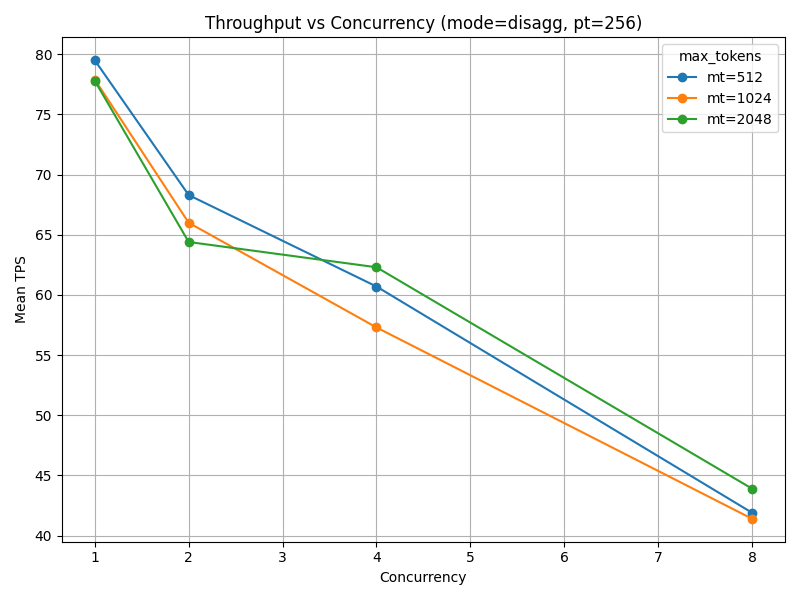
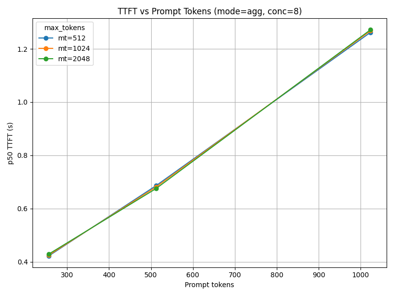

# Disaggregated-PD vLLM Benchmark Suite

This repository provides a **complete testbed** for both **disaggregated** (Prefill/Decode separated) and **aggregated** (single-server) vLLM setups, enabling quantitative comparison across Time-To-First-Token (TTFT) and throughput metrics.

---

## Overview

### Disaggregated Mode
- Separate **Prefill (Producer)** and **Decode (Consumer)** stages
- Communication through a lightweight **Quart HTTP proxy** and **ZeroMQ** service discovery
- Each component pinned to its own GPU for high concurrency testing

### Aggregated Mode
- Standard single-server vLLM instance (prefill + decode unified)
- Same model, dataset, and benchmarking pipeline for 1:1 comparability

---

## Repository Structure

```
disaggregated-pd-vllm/
├── proxy/                      # Proxy service (Quart + ZMQ)
│   └── disagg_proxy_p2p_nccl_xpyd.py
├── setup/                      
│   ├── pd_disagg_setup.sh      # Launch Proxy → Consumer → Producer
│   └── pd_agg_setup.sh         # Launch single aggregated vLLM
├── bench/                      
│   ├── bench_pd.py             # Async benchmark (TTFT + throughput)
│   ├── bench_proxy.sh          # Wrapper for disaggregated benchmark
│   └── bench_agg.sh            # Wrapper for aggregated benchmark
├── scripts/                    
│   ├── run_bench_vars.sh       # 1-click Benchmark + collect + plot
│   ├── bench_utils.py          # Shared metadata parser for filenames
│   ├── collect_from_log.py     # Parse logs to CSV
│   └── plot_bench_results.py   # Plot throughput/TTFT figures
├── results/
│   ├── bench_runs/             # Log + parsed CSV results
│   └── figures/                # Plots and raw figure data
└── samples/                    # Sample Figures
```

---

## Prerequisites

- Ubuntu 20.04+ with CUDA 11.8+
- Python 3.10+ (tested on 3.12)
- vLLM ≥ `0.11.0`
- Installed dependencies:

```bash
pip install -r requirements.txt
```

> Includes: `quart aiohttp msgpack pyzmq uvloop matplotlib pandas`

---

## Environment Variables

| Variable | Default | Description |
|-----------|----------|-------------|
| `SRV_IP` | autodetect | Node IP for proxy and discovery |
| `MODEL` | `Qwen/Qwen2.5-7B-Instruct` | Model name |
| `CACHE_DIR` | `/dev/shm/vllm_cache` | Cache directory for weights |
| `PROXY_HTTP_PORT` | 10001 | Proxy HTTP port |
| `PROXY_ZMQ_PORT` | 30001 | Proxy ZMQ service discovery |
| `CONS_HTTP_PORT` | 8200 | Consumer (Decode) HTTP port |
| `CONS_ZMQ_PORT` | 14579 | Consumer (Decode) ZMQ |
| `PROD_HTTP_PORT` | 8100 | Producer (Prefill) HTTP port |
| `PROD_ZMQ_PORT` | 14580 | Producer (Prefill) ZMQ |
| `CONS_GPU` | 2 | GPU index for Consumer |
| `PROD_GPU` | 1 | GPU index for Producer |
| `UTIL` | 0.8 | GPU memory utilization ratio |

---

## Quick Start

### Launch Disaggregated vLLM

```bash
cd setup
./pd_disagg_setup.sh
```

### Launch Aggregated vLLM

```bash
cd setup
./agg_setup.sh
```

---

## Benchmark Usage

### 1. Quick Start: Run All Benchmarks + Figures (1-Click)

You can run the full benchmark sweep, parse all logs, and generate all figures automatically with:

```bash
chmod +x scripts/run_bench_vars.sh
./scripts/run_bench_vars.sh
```
This script:
- Benchmarks both disaggregated and aggregated setups.
- Collects .log → .csv automatically.
- Generates all throughput and TTFT figures under results/figures/.

Default parameter grid:
- Concurrency ∈ {1, 2, 4, 8}
- Prompt tokens ∈ {256, 512, 1024}
- Max tokens ∈ {512, 1024, 2048}

All results are stored under:

```bash
results/
├── bench_runs/     # raw logs and parsed CSVs
└── figures/        # generated plots and raw merged CSVs
```

Example command with custom sweep:
```bash
MODEL=Qwen/Qwen2.5-7B-Instruct 
MODE_SET=both 
REQUESTS=100 
CONCURRENCIES=“1 2 4 8 16” 
PROMPT_TOKENS=“256 512” 
MAX_TOKENS=“512 1024” 
./scripts/run_bench_vars.sh
```

### 2. Run Individual Benchmark (Manual)

You can run a single benchmark manually for debugging:

```bash
python3 bench/bench_pd.py –host “$SRV_IP” –port 10001 –model “Qwen/Qwen2.5-7B-Instruct” –requests 10 –concurrency 16 –prompt-tokens 256 –max-tokens 512
```

---

## Parsing & Visualization

### 1. Parse Logs to CSV

```bash
python3 scripts/collect_from_log.py   --input results/bench_runs/run_disagg_model_Qwen_Qwen2.5-7B-Instruct_conc4_pt256_mt512.log   --output results/bench_runs/run_disagg_model_Qwen_Qwen2.5-7B-Instruct_conc4_pt256_mt512.csv
```

### 2. Generate Figures

```bash
python3 scripts/plot_bench_results.py
```

Output:
```
results/figures/
 ├── throughput_vs_concurrency_modeagg_pt256.png
 ├── throughput_vs_concurrency_modedisagg_pt256.png
 ├── ttft_vs_pt_modeagg_conc8.png
 ├── ttft_vs_pt_modedisagg_conc8.png
 ├── raw_all_merged.csv
 └── raw_*.csv
```

---

## Output Metrics

| Metric | Description |
|--------|-------------|
| `p50_ttft` | Median time-to-first-token |
| `p95_ttft` | 95th percentile TTFT |
| `mean_tps` | Mean per-request token throughput |
| `aggregate_throughput` | Total throughput (sum(tokens) / wall_time) |
| `wall_time_sec` | Total wall time of run |

---

## Example Results (A100, Qwen2.5-7B-Instruct)

**Disaggregated Mode**
```
== TTFT (stream=true) N=10 ==
  p50=0.653s  p95=0.781s  min=0.080s  max=0.793s

== Throughput (stream=false) N=10, errors=0 ==
  per-request tokens/sec: p50=69.2  p95=75.1  mean=67.8
  total generated tokens = 8294
  wall time (whole run)   = 8.48s
  aggregate throughput    = 977.8 tokens/sec
```

**Aggregated Mode**
```
== TTFT (stream=true) N=10 ==
  p50=0.712s  p95=0.880s  min=0.089s  max=0.901s

== Throughput (stream=false) N=10, errors=0 ==
  per-request tokens/sec: p50=57.5  p95=63.4  mean=59.1
  total generated tokens = 8301
  wall time (whole run)   = 10.12s
  aggregate throughput    = 820.2 tokens/sec
```

---

## Figures

Each plot automatically distinguishes:
- **Mode** → aggregated vs disaggregated
- **Concurrency** or **Prompt length** as x-axis
- **Max tokens** as multiple colored lines

Example outputs:

<p align="center">
  <br>
  <em>Throughput scaling vs concurrency, disaggregated mode</em>
</p>

<p align="center">
  <br>
  <em>TTFT vs prompt length, aggregated mode</em>
</p>

---

## Cleanup

```bash
pkill -f "disagg_proxy_p2p_nccl_xpyd.py" || true
pkill -f "vllm serve .*--port 8200" || true
pkill -f "vllm serve .*--port 8100" || true
pkill -f "vllm serve .*--port 9000" || true
```

---

## License

Apache License 2.0 — see `NOTICE.md` and `third_party_licenses/` for details.

---

# To-Do

## 1. Multi-producer / Multi-consumer (M * N)

### Goals
- Spin up N producers (prefill) and M consumers (decode).
- Proxy does round-robin / least-load routing for each role.
- Health checks + auto-deregister on failure.

## 2. Multi-round QA Benchmark Adaptation

### Goals
- Measure TTFT/throughput across dialogue turns with growing context (sliding or full context).
- Report per-round TTFT, cumulative latency, tokens/sec, and memory growth.
- https://github.com/LMCache/LMBenchmark/tree/main/real-multi-round-qa

## 3. Model Switch Allowance

### Goals
- Hot-switch models with minimal proxy change; sweep multiple models in one command.